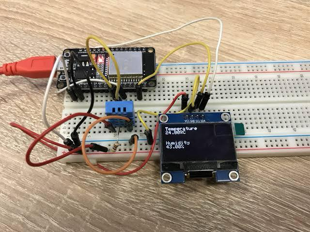
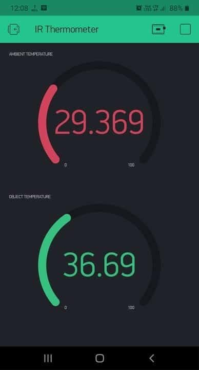

# IoT-Based Smart Furnace Controller for Inconel 718 Heat Treatment

  
<!-- Replace with actual path or URL, e.g., /images/furnace.jpg or https://i.imgur.com/example.jpg -->


This project integrates an IoT-based monitoring and control system into a heat treatment furnace used for processing 3D-printed Inconel 718. The goal is to enhance process control, reduce energy usage, and enable remote monitoring and automation.

## Overview

Using an ESP32 microcontroller and DHT11 sensor, the system continuously monitors real-time temperature and humidity and transmits data to the Blynk 2.0 platform. This setup allows remote access, process optimization, and optional relay-based automation for smart control of furnace cycles.

Deployed in a research lab, the system contributed to:

- Optimized solution annealing and aging cycles  
- 22% monthly energy savings  
- 2.5% improvement in final part hardness  

## Features

- Real-time temperature monitoring with DHT11 and ESP32  
- Remote access via Blynk App (Android / iOS / Web Dashboard)  
- Smart furnace control logic with optional relay-based ON/OFF switching  
- Data-driven optimization of heat treatment cycles  
- Energy-saving mode: Up to 88–112 kWh/month reduction  
- Metallurgical validation: Improved hardness and uniformity  

## Challenges Addressed

- Replaced manual thermocouple reading with live IoT data  
- Reduced idle-time power wastage (~22%)  
- Enabled remote alerts and scheduling  
- Ensured consistent thermal profiles for improved outcomes  

## Tech Stack

| Component       | Purpose                              |
|----------------|---------------------------------------|
| ESP32 Dev Board | Wi-Fi-enabled microcontroller         |
| DHT11 Sensor    | Temperature and humidity sensing      |
| Blynk 2.0       | IoT dashboard & remote control        |
| C++ (Arduino)   | Embedded firmware and integration     |
| Relay Module    | Optional physical ON/OFF control      |

## Installation & Setup

### 1. Hardware Connections

```
DHT11 Sensor:
  - Data → ESP32 GPIO 4
  - VCC  → 3.3V
  - GND  → GND

Relay Module (Optional):
  - IN   → ESP32 GPIO 5
  - VCC  → 5V
  - GND  → GND
```

### 2. Blynk Setup

- Register at https://blynk.cloud  
- Create a new project and note your Auth Token  
- Add the following Widgets:
  - Gauge (V0): Current Temperature  
  - Value Display (V1): Humidity  
  - Button (V2): Relay ON/OFF (Optional)  
  - Chart: For real-time and historical graphing  

### 3. Flash the Code

- Install Arduino IDE: https://www.arduino.cc/en/software  
- Install required libraries: DHT.h, WiFi.h, BlynkSimpleEsp32.h  
- Replace placeholders in code with your WiFi credentials and Blynk Auth Token  
- Upload the code to your ESP32  

```cpp
char auth[] = "Your_Blynk_Auth_Token";
char ssid[] = "Your_WiFi_SSID";
char pass[] = "Your_WiFi_Password";
```

## Results

- 2.5% increase in post-treatment hardness of Inconel 718  
- 22% average monthly energy savings  
- Reduced manual intervention by 50%  
- Opened path for future ML-based heat cycle prediction  

## Future Work

- Integration of full PID control loop for dynamic cycle control  
- Addition of more accurate sensors (e.g., thermocouples with MAX31855)  
- ML-based anomaly detection and predictive scheduling  
- Web dashboard with data export capabilities  

## Example Code

```cpp
#include <WiFi.h>
#include <BlynkSimpleEsp32.h>
#include "DHT.h"

#define DHTPIN 4
#define DHTTYPE DHT11
DHT dht(DHTPIN, DHTTYPE);

char auth[] = "Your_Blynk_Auth_Token";
char ssid[] = "Your_WiFi_SSID";
char pass[] = "Your_WiFi_Password";

BlynkTimer timer;

void sendSensor() {
  float temp = dht.readTemperature();
  float hum = dht.readHumidity();

  if (!isnan(temp) && !isnan(hum)) {
    Blynk.virtualWrite(V0, temp);
    Blynk.virtualWrite(V1, hum);
  }
}

void setup() {
  Serial.begin(115200);
  Blynk.begin(auth, ssid, pass);
  dht.begin();
  timer.setInterval(2000L, sendSensor);
}

void loop() {
  Blynk.run();
  timer.run();
}
```

## Contact

Feel free to raise issues or suggest features through GitHub.  
If you want help adapting this to your specific furnace or material system, open a discussion or issue.
